# Basic CI/CD

## Contents

1. [Настройка gitlab-runner](#part-1-настройка-gitlab-runner)  
2. [Сборка](#part-2-сборка)  
3. [Тест кодстайла](#part-3-тест-кодстайла)   
4. [Интеграционные тесты](#part-4-интеграционные-тесты)  
5. [Этап деплоя](#part-5-этап-деплоя)  
6. [Дополнительно. Уведомления](#part-6-дополнительно-уведомления)

### Part 1. Настройка **gitlab-runner**

**== Выполнение ==**

##### Подними виртуальную машину *Ubuntu Server 22.04 LTS*.

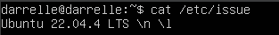

##### Скачай и установи на виртуальную машину **gitlab-runner**.

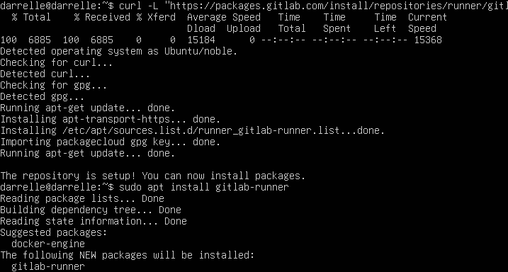

##### Запусти **gitlab-runner** и зарегистрируй его для использования в текущем проекте (*DO6_CICD*).

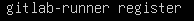

### Part 2. Сборка

**== Выполнение ==**

##### В файле _gitlab-ci.yml_ добавь этап запуска сборки через мейк файл из проекта _C2_. Файлы, полученные после сборки (артефакты), сохрани в произвольную директорию со сроком хранения 30 дней.

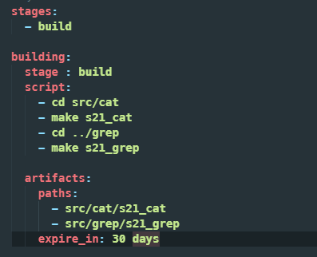

### Part 3. Тест кодстайла

**== Задание ==**

#### Напиши этап для **CI**, который запускает скрипт кодстайла (*clang-format*).

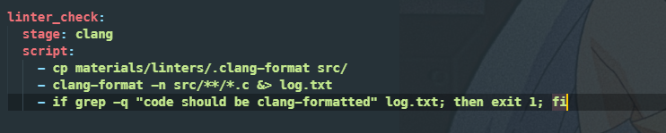

- Если есть ошибка в стиле кода

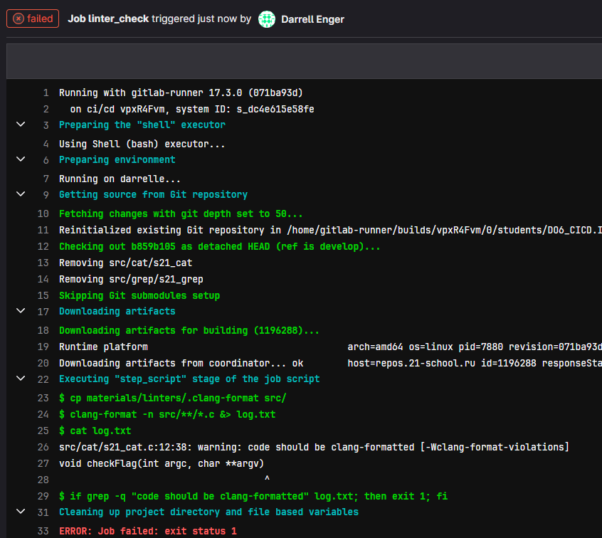

- Если её нету

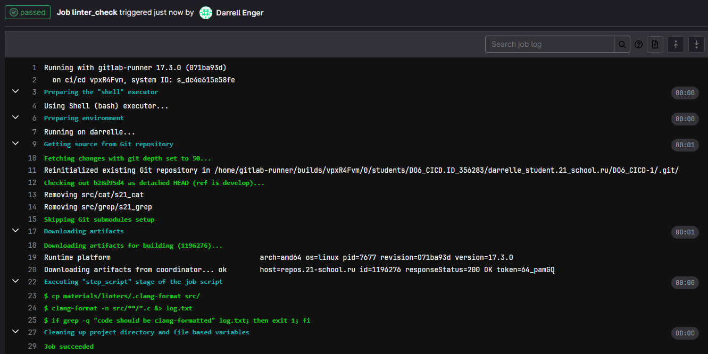

### Part 4. Интеграционные тесты

**== Задание ==**

#### Напиши этап для **CI**, который запускает твои интеграционные тесты из того же проекта.

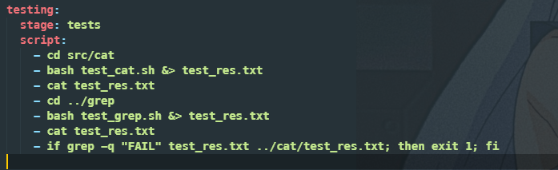

##### Если тесты не прошли, то «зафейли» пайплайн.

##### В пайплайне отобрази вывод, что интеграционные тесты успешно прошли / провалились.

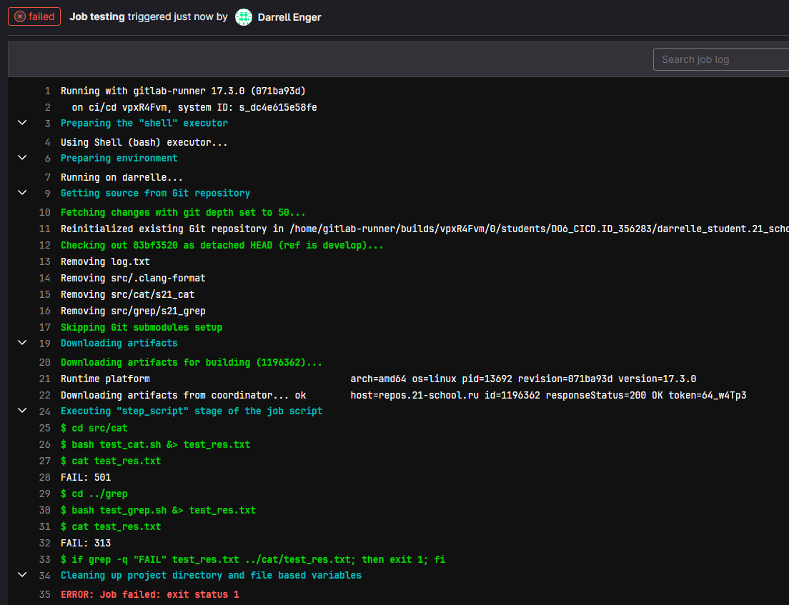

### Part 5. Этап деплоя

`-` Для завершения этого задания ты должен перенести исполняемые файлы на другую виртуальную машину, которая будет играть роль продакшна. Удачи.

**== Задание ==**

- Соединям две машины

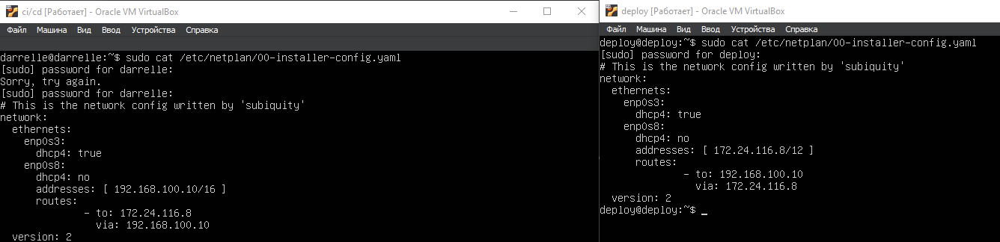

- Прописываем баш скрипт

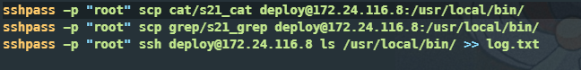

- Прописываем стадию деплоя

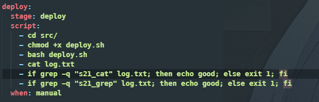

- Проверяем что всё работает

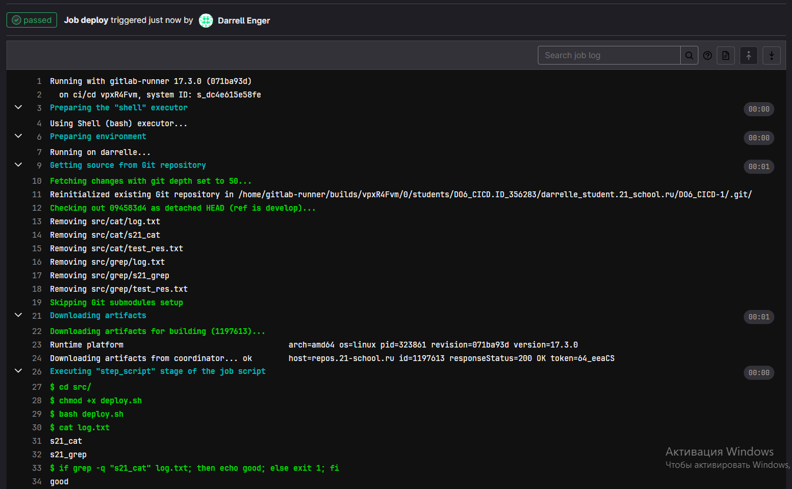

### Part 6. Дополнительно. Уведомления

**== Задание ==**

##### Настрой уведомления о успешном/неуспешном выполнении пайплайна через бота с именем «[твой nickname] DO6 CI/CD» в *Telegram*.

- Текст уведомления должен содержать информацию об успешности прохождения как этапа **CI**, так и этапа **CD**.
- В остальном текст уведомления может быть произвольным.
