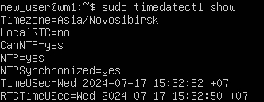
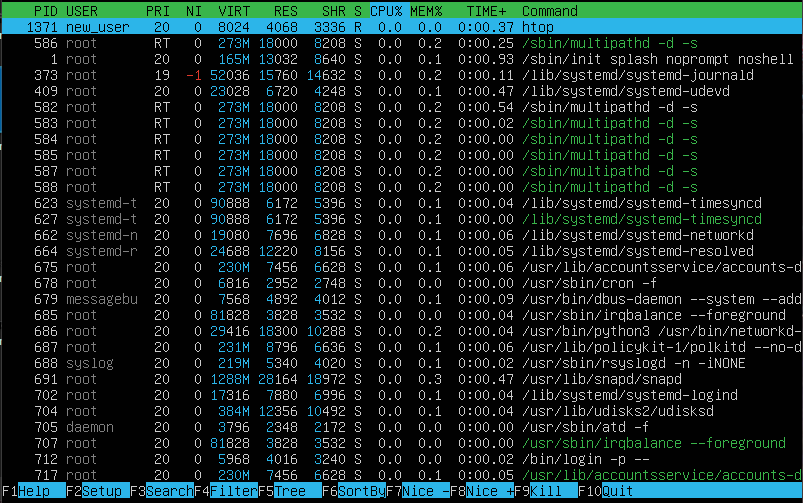
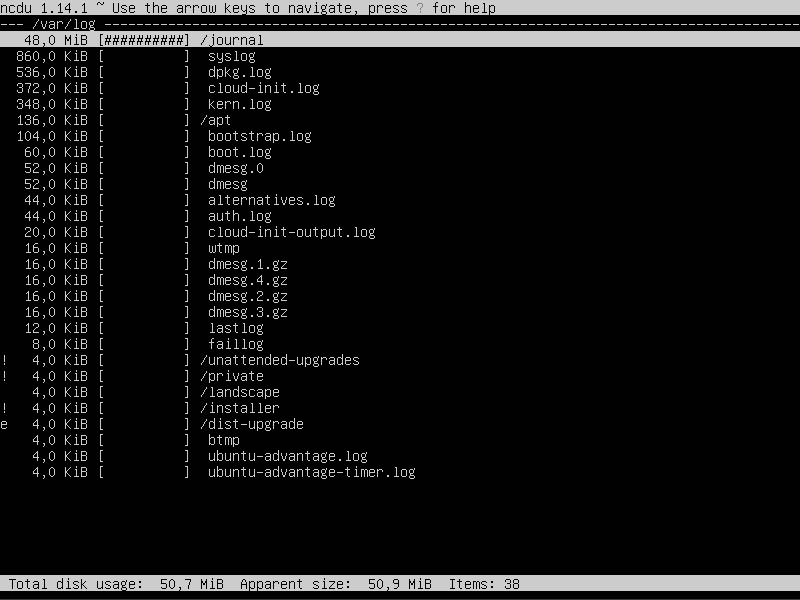

# Операционные системы UNIX/Linux (Базовый).

Установка и обновления системы Linux. Основы администрирования.

## Contents
1. [Установка ОС](#part-1-установка-ос)  
2. [Создание пользователя](#part-2-создание-пользователя)  
3. [Настройка сети ОС](#part-3-настройка-сети-ос)   
4. [Обновление ОС](#part-4-обновление-ос)  
5. [Использование команды  sudo](#part-5-использование-команды-sudo)  
6. [Установка и настройка службы времени](#part-6-установка-и-настройка-службы-времени)  
7. [Установка и использование текстовых редакторов](#part-7-установка-и-использование-текстовых-редакторов)  
8. [Установка и базовая настройка сервиса SSHD](#part-8-установка-и-базовая-настройка-сервиса-sshd)   
9. [Установка и использование утилит top, htop](#part-9-установка-и-использование-утилит-top-htop)   
10. [Использование утилиты fdisk](#part-10-использование-утилиты-fdisk)   
11. [Использование утилиты df](#part-11-использование-утилиты-df)    
12. [Использование утилиты du](#part-12-использование-утилиты-du)    
13. [Установка и использование утилиты ncdu](#part-13-установка-и-использование-утилиты-ncdu)    
14. [Работа с системными журналами](#part-14-работа-с-системными-журналами)     
15. [Использование планировщика заданий CRON](#part-15-использование-планировщика-заданий-cron)    

## Part 1. Установка ОС

**== Задание ==**

##### Установи **Ubuntu 20.04 Server LTS** без графического интерфейса. (Используем программу для виртуализации - VirtualBox)

- Графический интерфейс должен отсутствовать.

- Узнай версию Ubuntu, выполнив команду \
`cat /etc/issue`
- Вставь скриншот с выводом команды.

**== Выполнение ==**

- Результат команды `cat /etc/issue`

)

## Part 2. Создание пользователя

**== Задание ==**

##### Создай пользователя, отличного от созданного при установке. Пользователь должен быть добавлен в группу `adm`.

- Вставь скриншот вызова команды для создания пользователя.
- Новый пользователь должен быть в выводе команды \
`cat /etc/passwd`
- Вставь скриншот с выводом команды.

**== Выполнение ==**

- Для создания пользователя используем команду `sudo adduser new_user`

- Далее добавляем его в группу командой `sudo usermod -aG adm new_user`

- Выводим список пользователей командой `cat /etc/passwd`

## Part 3. Настройка сети ОС

**== Выполнение задания 1 ==**

Задай название машины вида user-1

- Выполняем команду `sudo hostname user-1`

- Выполняя `sudo hostname` проверяем результат

**== Выполнение задания 2 ==**

Установи временную зону, соответствующую твоему текущему местоположению.

**== Выполнение задания 3 ==**

Выведи названия сетевых интерфейсов с помощью консольной команды.

- Lo (loopback device) – виртуальный интерфейс, присутствующий по умолчанию в любом Linux. Он используется для отладки сетевых программ и запуска серверных приложений на локальной машине. С этим интерфейсом всегда связан адрес 127.0.0.1. У него есть dns-имя – localhost.

**== Выполнение задания 4 ==**

Используя консольную команду, получи ip адрес устройства, на котором ты работаешь, от DHCP сервера

- DHCP (Dynamic Host Configuration Protocol) — это сетевой протокол, который позволяет сетевым устройствам автоматически получать IP-адрес и другие параметры, необходимые для работы в сети TCP/IP.

**== Выполнение задания 5 ==**

Определи и выведи на экран внешний ip-адрес шлюза (ip) и внутренний IP-адрес шлюза, он же ip-адрес по умолчанию (gw).

**== Выполнение задания 6 ==**

Задай статичные (заданные вручную, а не полученные от DHCP сервера) настройки ip, gw, dns (используй публичный DNS серверы, например 1.1.1.1 или 8.8.8.8).

- Редактируем файл под нужные настройки используя `sudo vim /etc/netplan/00-installer-config.yaml`

- Сохраняем изменения командой `sudo netplan apply`

**== Выполнение задания 7 ==**

Перезагрузи виртуальную машину. Убедись, что статичные сетевые настройки (ip, gw, dns) соответствуют заданным в предыдущем пункте.
Успешно пропингуй удаленные хосты 1.1.1.1 и ya.ru и вставь в отчёт скрин с выводом команды. В выводе команды должна быть фраза «0% packet loss».

- Перезапускаем виртуальную машину командой `reboot`

- Пингуем `hostname -I && ping -c 4 1.1.1.1 | grep "stat\|loss" && ping -c 4 ya.ru`

## Part 4. Обновление ОС

**== Задание ==**

##### Обнови системные пакеты до последней на момент выполнения задания версии.  

- После обновления системных пакетов, если ввести команду обновления повторно, должно появиться сообщение, что обновления отсутствуют;
- Вставь скриншот с этим сообщением в отчёт.

**== Выполнение задания ==**

- Используем команду для получения пакетов `sudo apt update`

- Используем команду для обновления пакетов `sudo apt upgrade`

## Part 5. Использование команды **sudo**

**== Задание ==**

##### Разреши пользователю, созданному в [Part 2](#part-2-создание-пользователя),выполнять команду sudo.

- В отчёте объясни *истинное* назначение команды sudo (про то, что это слово - «волшебное», писать не стоит);  
- Поменяй hostname ОС от имени пользователя, созданного в пункте [Part 2](#part-2-создание-пользователя) (используя sudo);
- Вставь скрин с изменённым hostname в отчёт.

**== Выполнение задания ==**

- Sudo — это утилита, предоставляющая привилегии root для выполнения административных операций в соответствии со своими настройками.

- Даём права на использование sudo командой `sudo usermod -G sudo new_user`

- Переходим на нового пользователя `su - new_user`

- Меняем hostname

## Part 6. Установка и настройка службы времени

**== Задание ==**

##### Настрой службу автоматической синхронизации времени.  

- Выведи время часового пояса, в котором ты сейчас находишься.
- Вывод следующей команды должен содержать `NTPSynchronized=yes`: \
  `timedatectl show`
- Вставь скрины с корректным временем и выводом команды в отчёт.

**== Выполнение задания ==**

- Установка NTP командой `sudo apt install systemd-timesyncd`

- Активируем NTP командой `sudo timedatectl set-ntp on`

- Вывод команды `timedatectl show`

## Part 7. Установка и использование текстовых редакторов 

**== Выполнение задания 1 ==**

Установи текстовые редакторы **VIM** (+ любые два по желанию **NANO**, **MCEDIT**, **JOE** и т.д.)  

- Устанавливаем текстовый редактор MCEDIT `sudo apt install mcedit`

**== Выполнение задания 2 ==**

Используя каждый из трех выбранных редакторов, создай файл *test_X.txt*, где X -- название редактора, в котором создан файл. Напиши в нём свой никнейм, закрой файл с сохранением изменений.  
- В отчёт вставь скриншоты:
  - Из каждого редактора с содержимым файла перед закрытием;
- В отчёте укажи, что сделал для выхода с сохранением изменений.

**VIM**

- Создаем файл с помощью команды `vim test_vim.txt`

- Нажимаем `i` для перехода в режим редактирования

- Пишем ник: `darrelle`

- Для выхода с сохранением нажимаем Esc вводим команду `:wq!` и нажимаем `Enter`

**NANO**

- Создаем файл с помощью команды `nano test_nano.txt`

- Пишем ник: `darrelle`

- Для выхода нажимаем комбинацию `ctrl+x` для сохранения вводим `Y` и нажимаем `Enter`

**MCEDIT**

- Создаем файл с помощью команды `mcedit test_mcedit.txt`

- Пишем ник: `darrelle`

- Для выхода с сохранением нажимаем `Esc`, а затем клавишу `YES`

**== Выполнение задания 3 ==**

Используя каждый из трех выбранных редакторов, открой файл на редактирование, отредактируй файл, заменив никнейм на строку «21 School 21», закрой файл без сохранения изменений.
- В отчёт вставь скриншоты:
    - Из каждого редактора с содержимым файла после редактирования;
- В отчёте укажи, что сделал для выхода без сохранения изменений.

**VIM**

- Открываем файл с помощью команды `vim test_vim.txt`

- Нажимаем `i` для перехода в режим редактирования

- Изменяем ник на `21 School 21`

- Для выхода без сохранения нажимаем Esc вводим команду `:q!` и нажимаем `Enter`

**NANO**

- Создаем файл с помощью команды `nano test_nano.txt`

- Изменяем ник на `21 School 21`

- Для выхода нажимаем комбинацию `ctrl+x` для сохранения вводим `N` и нажимаем `Enter`

**MCEDIT**

- Создаем файл с помощью команды `mcedit test_mcedit.txt`

- Пишем ник: `darrelle`

- Для выхода с сохранением нажимаем `Esc`, а затем клавишу `NO`

**== Выполнение задания 4 ==**

Используя каждый из трех выбранных редакторов, отредактируй файл ещё раз (по аналогии с предыдущим пунктом), а затем освой функции поиска по содержимому файла (слово) и замены слова на любое другое.
- В отчёт вставь скриншоты:
    - Из каждого редактора с результатами поиска слова;
    - Из каждого редактора с командами, введёнными для замены слова на другое.

**VIM**

- Открываем файл с помощью команды `vim test_vim.txt`

- Для поиска в VIM вводим `/darrelle`

Для замены слова в VIM вводим `:%s/almaveno/21 School 21` и слово `darrelle` заменяется на `21 School 21`

**NANO**

- Открываем файл с помощью команды `nano test_nano.txt`

- Для поиска в NANO вводим `ctrl + W`

- Для замены слова в NANO вводим `ctrl + \`, пишем `darrelle`, нажимаем Enter, пишем `21 School 21`, нажимаем `Enter`, выбираем `Y`

**MCEDIT**

- Открываем файл с помощью команды `mcedit test_mcedit.txt`

- Для поиска в mcedit вводим `F7`, затем вводим слово, которое хотим найти

- Для замены слова в mcedit жмем F4, затем вводим `darrelle`, нажимаем стрелку вниз, пишем `21 School 21`

## Part 8. Установка и базовая настройка сервиса **SSHD**

**== Задание ==**

**== Выполнение задания 1 ==**

Установи службу SSHd.

- Устанавливаем командой `sudo apt install openssh-server`

**== Выполнение задания 2 ==**

Добавь автостарт службы при загрузке системы.

- Добавляем автостарт службы SSHd командой `sudo update-rc.d ssh defaults`

**== Выполнение задания 3 ==**

Перенастрой службу SSHd на порт 2022.

- Открываем конфиг `sudo nano /etc/ssh/sshd_config`

- Ставим порт 2022

**== Выполнение задания 4 ==**

Используя команду ps, покажи наличие процесса sshd. Для этого к команде нужно подобрать ключи.
- В отчёте объясни значение команды и каждого ключа в ней.

- Команда `ps` показывает текущие процессы на сервере.

- Команда `grep` позволяет выдилить нужную нам информацию по процессам

- Флаг `-a` оставляет все процессы, кроме лидеров сеансов и процессов, не связанных с терминалом

- Флаг `-x` заставляет `ps` отображать список всех процессов, которыми вы владеете

- Флаг `-f` выводит полноформатный список

- Флаг `-v` выводит информацию о версии

**== Выполнение задания 5 ==**

- Вывод команды netstat -tan должен содержать  \
`tcp 0 0 0.0.0.0:2022 0.0.0.0:* LISTEN`  \
(если команды netstat нет, то ее нужно установить)
- Скрин с выводом команды вставь в отчёт.
- В отчёте объясни значение ключей -tan, значение каждого столбца вывода, значение 0.0.0.0.

- Устанавливаем net-tools `sudo apt install net-tools`

- Выполняем команду `netstat -tan`

- Флаг `-a` показывает состояние всех сокетов

- Флаг `-n` показывает ip адрес, а не сетевое имя

- Флаг `-t` показывает только tcp соединения

- Cтобец Proto - протокол, используемый сокетом

- Cтобец Recv-Q - количество байтов, не скопированных пользовательской программой, подключенной к этому сокету

- Cтобец Send-Q Количество байт, не подтвержденных удаленным хостом

- Cтобец Local Adbress - локальный адрес и номер порта сокета

- Cтобец Foreign Adbress - удаленный адрес и номер порта сокета

- Cтобец State - состояние сокета

- 0.0.0.0 в выводе netstat означает, что ssh daemon прослушивает все интерфейсы IPv4, которые есть у машины

## Part 9. Установка и использование утилит **top**, **htop**

**== Задание ==**

##### Установи и запусти утилиты top и htop.  

- По выводу команды top определи и напиши в отчёте:
  - uptime
  - количество авторизованных пользователей
  - общую загрузку системы
  - общее количество процессов
  - загрузку cpu
  - загрузку памяти
  - pid процесса занимающего больше всего памяти
  - pid процесса, занимающего больше всего процессорного времени
- В отчёт вставь скрин с выводом команды htop:
  - отсортированному по PID, PERCENT_CPU, PERCENT_MEM, TIME
  - отфильтрованному для процесса sshd
  - с процессом syslog, найденным, используя поиск 
  - с добавленным выводом hostname, clock и uptime

**== Выполнение задания ==**

- Выполняем команду `top`

	- uptime

	

	- количество авторизованных пользователей

	

	- общую загрузку системы

	

	- общее количество процессов

	

	- загрузку cpu

	

	- загрузку памяти

	

	- pid процесса занимающего больше всего памяти

	

	- pid процесса, занимающего больше всего процессорного времени

	

- Выполняем команду `htop`

  - отсортированному по PID

	

  - отсортированному по PERCENT_CPU

	

  - отсортированному по PERCENT_MEM

	

  - отсортированному по TIME

	

  - отфильтрованному для процесса sshd

	

  - с процессом syslog, найденным, используя поиск 

	

## Part 10. Использование утилиты **fdisk**

**== Задание ==**

##### Запусти команду fdisk -l.

- В отчёте напиши название жесткого диска, его размер и количество секторов, а также размер swap.

**== Выполнение задания ==**

- Название

	
- Размер

	
- Кол-во секторов

	
- Размер swap
	- Используем команду `free -h`

## Part 11. Использование утилиты **df** 

**== Выполнение задания 1 ==**

Запусти команду df.
- В отчёте напиши для корневого раздела (/):
  - размер раздела
	
	

  - размер занятого пространства

	

  - размер свободного пространства

	

  - процент использования

	

**== Выполнение задания 2 ==**

Запусти команду df -Th.
- В отчёте напиши для корневого раздела (/):
  - размер раздела

	

  - размер занятого пространства

	
	
  - размер свободного пространства

	

  - процент использования

	

  - тип файловой системы для раздела.

	

## Part 12. Использование утилиты **du**

**== Задание ==**

##### Запусти команду du
##### Выведи размер папок /home, /var, /var/log (в байтах, в человекочитаемом виде)
##### Выведи размер всего содержимого в /var/log (не общее, а каждого вложенного элемента, используя *)

**== Выполнение задания ==**

- Запускаем команду `du`

	

- Выводим размер папок в байтах
	
	

- Выводим размер папок в человекочитаемом виде
	
	

- Выводим размер всего в /var/log

	

## Part 13. Установка и использование утилиты **ncdu**

**== Задание ==**

##### Установи утилиту ncdu
##### Выведи размер папок /home, /var, /var/log

- Размеры должны примерно совпадать с полученными в [Part 12](#part-12-использование-утилиты-du).

- В отчёт вставь скрины с выводом использованных команд.

**== Выполнение задания ==**

- Размер /home

- Размер /var

- Размер /var/log

## Part 14. Работа с системными журналами

**== Задание ==**

##### Открой для просмотра:
##### 1. /var/log/dmesg
##### 2. /var/log/syslog
##### 3. /var/log/auth.log  

- Напиши в отчёте время последней успешной авторизации, имя пользователя и метод входа в систему;
- Перезапусти службу SSHd;
- Вставь в отчёт скрин с сообщением о рестарте службы (искать в логах).

**== Выполнение задания ==**

- Просмотр `/var/log/dmesg`

- Просмотр `/var/log/syslog`

- Просмотр `/var/log/auth.log`

- Используем команду `last` для просмотра последней авторизации, имени пользователя и метода входа в систему

- Время авторизации Jul 17 16:13
- Имя пользователя new_user
-	Метод входа в систему tty1

- Перезапускаем службу SSHd

- Выводим сообщение о рестарте служб

## Part 15. Использование планировщика заданий **CRON**

`-` Фух, наконец-то мы добрались до последней части моего долгого повествования. Сейчас я покажу программу, которая, помимо прочего, заметно упрощает периодический вызов других программ.

**== Задание ==**

##### Используя планировщик заданий, запусти команду uptime через каждые 2 минуты.
- Найди в системных журналах строчки (минимум две в заданном временном диапазоне) о выполнении;
- Выведи на экран список текущих заданий для CRON;
- Вставь в отчёт скрины со строчками о выполнении и списком текущих задач.

##### Удали все задания из планировщика заданий.
- В отчёт вставь скрин со списком текущих заданий для CRON.

**== Выполнение задания ==**

- Устанавливаем CRON `sudo apt install cron`

- Планируем задачу командой `crontab -e`

- Записываем задачу

- Выводим список установленых задач командой `crontab -e`

- Удаляем все задачи командой `crontab -r`

