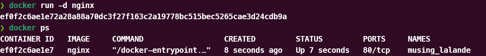

# Simple Docker

1. [Готовый докер](#part-1-готовый-докер)
2. [Операции с контейнером](#part-2-операции-с-контейнером)
3. [Мини веб-сервер](#part-3-мини-веб-сервер) 
4. [Свой докер](#part-4-свой-докер) 
5. [Dockle](#part-5-dockle) 
6. [Базовый Docker Compose](#part-6-базовый-docker-compose)

## Part 1. Готовый докер

**== Выполнение ==**

- Устанавливаем nginx

- Проверяем его наличие

- Запускаем образ и проверяем запустился ли он

- Проверяем информацию о контейнере

- Размер контейнера

- Список замапленных портов

- IP контейнера

- Останавливаем контейнер

- Запускаем докер с портами 80:80 и 443:443

- Проверяем в браузере

- Рестартанём контейнер

## Part 2. Операции с контейнером

##### Проверь, что по адресу *localhost:80/status* отдается страничка со статусом сервера **nginx**.

**== Выполнение ==**

- Читаем конфигурационный файл *nginx.conf* внутри докер контейнера 

- Переписываем конфигуратор

- Отправляем его в контейнер

- Перезапускаем nginx

- Переходим на `localhost:80/status`

- Экспортируем контейнер в файл *container.tar*

- Останавливаем контейнер

- Удаляем образ

- Удаляем контейнер

- Импортируем контейнер обратно

- Запускаем импортированный контейнер.

- Проверяем, что по адресу *localhost:80/status* отдается страничка со статусом сервера **nginx**.

## Part 3. Мини веб-сервер

**== Выполнение ==**

- Пишем свой мини-сервер

- Компилируем и запускаем с помощью команд `gcc -o hello hello.c -lfcgi` и `spawn-fcgi -p 8080 hello`

- Пишем свой nginx.conf

- Перезапускаем `nginx -s reload`

- Заходим в браузере на `localhost:81`

- Ложим наш конфигуратор по пути `./nginx/nginx.conf`

## Part 4. Свой докер

**== Выполнение ==**

- Пишем свой докерфайл

- Собираем докер-образ 

- Проверяем собрался ли он

- Запускаем

- Проверяем наш `localhost:80`

- Дописываем nginx.conf и перезапускаем докер-образ

- Проверяем наш `localhost:80/status`

## Part 5. **Dockle**

**== Выполнение ==**

- Запускаем dockle

- Исправляем все ошибки в Dockerfile

- Проверяем на ошибки

## Part 6. Базовый **Docker Compose**

**== Выполнение ==**

- Пишем файл `docker-compose.yml`

- Пишем ещё один nginx.conf для второго контейнера

- Собираем проект

- Запускаем проект

- Проверяем `localhost:80`

